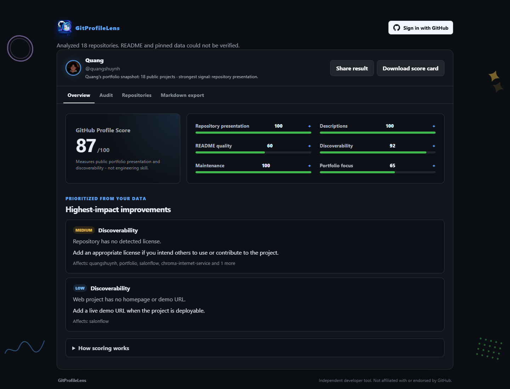

<p align="center">
  
</p>

# GitProfileLens

[](https://github.com/quangshuynh/gitprofilelens/actions/workflows/ci.yml)
[](LICENSE)
[](https://gitprofilelens.vercel.app/)

## What's your GitHub portfolio score?

GitProfileLens turns a public GitHub profile into a transparent 0–100 presentation score with actionable recommendations. Public audits require no login. An optional GitHub App connection can also audit authorized private repositories and identify projects worth preparing for a public portfolio.

GitProfileLens evaluates presentation and discoverability, not developer ability, employability, code quality, or engineering skill.

### [Try the live audit →](https://gitprofilelens.vercel.app/)



## Two deliberately separate modes

### Public Portfolio Audit

Enter any GitHub username without signing in. The public audit:

- Fetches every public repository owned by the account.
- Calculates the public GitHub Profile Score and six explainable categories.
- Audits names, descriptions, READMEs, topics, licenses, demos, and maintenance.
- Ranks actionable portfolio recommendations.
- Classifies each repository as a portfolio candidate, separately from its score.
- Recommends a pinned repository set, and shows how it differs from the current pins.
- Supports shareable `?user=USERNAME` links and downloadable score cards.
- Explores public repository metadata and exports it to Markdown.
- Provides the public JSON endpoint `GET /api/report?user=USERNAME`.

### Private Repository Audit

Sign in with GitHub and install the GitHub App on all or selected repositories. The private audit:

- Retrieves only repositories available to both the signed-in user and the app installation.
- Focuses on repositories owned by the signed-in account.
- Reuses the deterministic repository presentation checks.
- Labels each repository as Private or Public.
- Applies the same portfolio candidacy classification used by the public audit, so private work can be evaluated as a potential portfolio project.
- Recognizes strong private work in the pinned optimizer while keeping it out of the set a public profile could pin.
- Exports Markdown containing public repositories, authorized private repositories, or both.

Private repositories never affect the public GitHub Profile Score. Private identifiers are not included in public URLs, score cards, public metadata endpoints, or `/api/report`. Private details enter Markdown only when the authenticated user explicitly selects a private or combined export.

## Network tab

**Network** is one of the profile result tabs, alongside Overview, Audit, Repositories and Markdown export. It retrieves the audited profile's public followers and following lists and exports them as Markdown.

- It operates on the profile already loaded into GitProfileLens. There is no second username to enter.
- The lists are fetched the first time the tab is opened, not during the audit itself, so an ordinary audit spends none of the limited unauthenticated request budget on them. A successful result is cached for that username, so leaving the tab and returning does not refetch. Auditing a different profile invalidates it.
- Both lists are paginated at 100 accounts per request until GitHub returns a short page, so the tab is not limited to the first 30 or 100 accounts.
- It reads only publicly accessible follower and following data from GitHub's public REST API, and needs no additional permissions.

### List ordering

Accounts appear in the order GitHub's API returned them, and both the tab and the export say so.

GitProfileLens does not present these lists as a newest-to-oldest follow history, because GitHub does not publish the evidence such a claim would need. The REST responses carry no field recording when one account followed another, the endpoints document no ordering and accept no `sort` parameter, the GraphQL follower and following edges expose only a cursor and a user node with no `orderBy` argument, and the Events API keeps at most 300 events from the past 30 days, which cannot reconstruct a full follow history. An account's `created_at` is when that account joined GitHub, not when the follow happened, and is never used as a substitute.

[docs/network-ordering.md](docs/network-ordering.md) records the evidence in full, including a measurement of what the response order actually tracks.

### Following who don't follow back

The tab also derives the accounts the profile follows that do not follow it back: the following list minus the followers list, comparing logins case-insensitively because GitHub treats them as case-insensitive identities. Results keep the spelling and ordering GitHub returned for the following list.

This is derived **only when both lists have been retrieved completely**. If either list is incomplete, the section is withheld rather than shown, because a login missing from a partial followers list may simply sit on a page that never arrived - calling that account a non-follower would be unsound. The same completeness rule gates the Markdown export.

It is a factual relationship difference, nothing more. GitProfileLens does not score, rank or recommend followers, does not suggest who to follow or unfollow, and never follows or unfollows anyone.

### Network Markdown

**Copy Markdown** and **Download .md** live inside the Network tab and produce a document separate from the repository report in the Markdown export tab. It contains the username, the three counts, and the Followers, Following, and Following who don't follow back lists. An empty list is written as `None.`, which is known data rather than missing data.

GitHub relationship data can change while the lists are being retrieved. When the profile's reported counts disagree with the retrieved lists, the export uses the accounts GitHub actually returned, never invented ones, and states the difference. The file is generated in the browser from a sanitized username, for example `quangshuynh-followers-following.md`; nothing is sent to another server to produce it.
## How scoring works

The deterministic scoring engine lives in `audit.js` and is shared by the browser, serverless routes, and tests. Each repository receives scores for:

- Repository presentation: name clarity and consistency.
- Descriptions: specificity, useful length, placeholder text, and basic polish.
- README quality: presence, useful length, overview, setup, usage, examples, code samples, visuals, and contribution guidance.
- Discoverability: topics, license, and a demo link where useful.
- Maintenance: push recency while treating archived projects as intentionally complete.

The public profile score aggregates those repository results and adds portfolio focus. Every finding includes a severity, reason, suggested action, and a factual or advisory classification. Unknown README data receives a neutral score and is marked unverified.

Fork status comes directly from GitHub's repository metadata: `fork: true` means GitHub identifies the repository as a fork. GitProfileLens does not infer fork status or estimate how much work the profile owner contributed. Forks remain auditable and are not given an automatic quality penalty; their presentation score describes repository metadata and README quality, not authorship of inherited content.

## Portfolio candidacy

Alongside the score, every audited repository receives a deterministic candidacy label answering a different question: **is this a good repository to feature prominently?**

| Label | Meaning |
| --- | --- |
| **Strong candidate** | Confirmed original work, verified and substantive README, meaningful description, discoverable, reasonably current, no major presentation findings |
| **Worth polishing** | A real foundation with named, fixable gaps, or a repository whose candidacy cannot be asserted outright |
| **De-emphasize** | Severe presentation gaps, unexplained abandonment, or several weaknesses together |

The label is **not** a score band. A fork can score 100 and still be Worth polishing; an original repository scoring 63 can be Worth polishing too. Each label carries a one-line explanation derived from that repository's own evidence.

- **Forks.** A GitHub-identified fork is never a Strong candidate on presentation alone. GitProfileLens cannot determine how much of the implementation belongs to the profile owner, so it says exactly that rather than claiming the owner did no work. Forks are not called bad and are not hidden.
- **Archived repositories.** Not hidden and not automatically de-emphasized. A well-presented archive is classified honestly, with archival status named as the reason it is a weaker choice to lead with.
- **Private repositories.** Judged by identical rules. Privacy never counts against a project, and a strong private original project can be a Strong candidate for future public presentation. GitProfileLens does not suggest exposing private details.
- **Unavailable metadata.** Unknown is never treated as missing. An unverified README is never described as absent, and unavailable evidence cannot push a repository toward De-emphasize. It does prevent an outright Strong claim, which is shown as `Some metadata unavailable`.

Candidacy is derived from the finished audit and never changes the score. Classification does not read source code, commit ownership, upstream divergence, or contribution share, and requires no additional GitHub permissions.

## Pinned repository optimizer

GitHub profiles pin up to six repositories. The **Pinned optimizer** tab answers a third question, separate from both the score and per-repository candidacy: **which combination of repositories forms the strongest portfolio set?**

It shows the recommended set, what GitHub currently reports as pinned, and the difference between them as advisory actions — Keep, Polish first, Consider adding, Consider replacing. When the current pins already match the recommendation, it says so instead of manufacturing a change.

- **Up to six, never padded.** A profile with three repositories meeting the criteria is told that, and is not offered three weak ones to fill the remaining slots.
- **Eligibility comes before ranking.** A high score alone does not qualify a repository. De-emphasized repositories, repositories with an open high-priority finding, and repositories with no verified description or README content are excluded, with the reason shown.
- **Rules, not a hidden score.** Selection is a fixed lexicographic order: candidacy, then confirmed original work over unreported fork status over a GitHub-identified fork, then active over archived, then how much a repository repeats the set so far, then presentation score, maintenance, verified metadata, and finally name. There is no internal utility number.
- **Diversity is evidence, not a target.** Only primary language and topic overlap are compared. GitProfileLens has no reliable project or domain categories and does not invent any. A repository with no reported language or no topics earns no breadth claim and takes no penalty for it.
- **Private work is separated, not judged.** A private repository can be strong portfolio work and still be something a public profile cannot pin. Both are stated, and publishing is never suggested.
- **Every recommendation is explained** from that repository's own evidence, and a replacement explains the actual difference rather than asserting that one repository is better.
- **No circularity.** Current pin state is used only for the comparison, never as evidence that a repository deserves to be recommended.

Opening the tab issues no additional GitHub request: it runs over the audit already in memory and changes no score.

[docs/scoring.md](docs/scoring.md) documents every rule and weight, the full candidacy rules, what the score intentionally does not measure, known limitations, and how to change scoring safely.

## Privacy and authentication

GitProfileLens uses the GitHub App web authorization flow and requests read-only repository access. Users choose which repositories the app may access through GitHub's installation interface.

- GitHub access and refresh tokens are encrypted with AES-256-GCM inside an `HttpOnly`, same-site session cookie.
- Production cookies use `Secure` and expire after eight hours.
- OAuth requests use unpredictable, short-lived state values that are verified before callback processing.
- Authenticated endpoints send private, no-store cache headers and are not eligible for shared CDN caching.
- Browser JavaScript receives only safe sign-in identity data, never raw tokens or session secrets.
- Private repository responses are processed for the current request and are not permanently stored by GitProfileLens.
- Private Markdown reports are generated locally in the browser and cleared from page state on logout.
- Logout clears the GitProfileLens session cookie. It does not sign the user out of GitHub.

The server necessarily receives authorized GitHub API responses while producing an audit. Avoid granting the GitHub App access to repositories you do not want GitProfileLens to process.

## JSON report API

The JSON API remains public-only:

```text
GET /api/report?user=quangshuynh
```

It returns normalized public repository metadata and never uses the signed-in browser session to add private data. The endpoint requires the server-side `GITHUB_TOKEN`.

The response distinguishes repositories owned by the requested account from external contributed repositories:

- `repositories` contains public repositories owned by the account. `public_repositories` is always the length of this array.
- `pinned_repositories` contains only profile pins from those owned repositories.
- `contributed_repositories` contains public repositories owned by someone else where GitHub attributes at least one merged pull request to the requested account.

External contributions are informational. They are not added to owned repositories or pins, exported as owned work, or included in the portfolio score because the contributor may not control the repository's presentation and maintenance. Discovery uses authored public pull requests, groups them by repository, and reports both total authored and merged counts; v1 requires at least one merged pull request for inclusion. It does not infer contributions from membership, stars, watches, or forks.

Only normalized public fields are returned. Private repository and pull-request details are excluded. Contribution discovery is bounded to GitHub Search's first 1,000 results and may be incomplete for unusually prolific accounts or when GitHub Search indexing lags. If this supplemental lookup fails or is rate-limited, the owned-repository report remains available with `contributed_repositories: []`.

Example contribution entry:

```json
{
  "owner": "hymical",
  "name": "forms",
  "full_name": "hymical/forms",
  "url": "https://github.com/hymical/forms",
  "description": "Repository description",
  "primary_language": "Python",
  "stars": 0,
  "forks": 0,
  "contribution": {
    "pull_requests": 4,
    "merged_pull_requests": 4
  }
}
```

## Local setup

GitProfileLens is a static front end plus a set of serverless functions in `api/`. The browser fetches basic repository data straight from GitHub's public REST API, but it asks its **own origin** for README and pinned-repository enrichment:

```text
browser → GET /api/pinned-repositories → GitHub GraphQL
```

That means the origin serving the page has to be able to execute `api/*.js`. A plain static file server cannot, so use the full local runtime for anything that touches GitHub metadata.

### Full local development

This is the canonical way to run GitProfileLens locally with the same metadata capabilities as production.

**Prerequisites**

- Node.js 24
- The Vercel CLI: `npm i -g vercel`
- A GitHub token for public metadata enrichment. A classic token with no scopes is enough.

**Setup**

```bash
git clone https://github.com/quangshuynh/gitprofilelens.git
cd gitprofilelens
npm install
cp .env.example .env.local
```

Fill in `.env.local`. Only `GITHUB_TOKEN` is required for the public audit; the GitHub App variables are needed only for the authenticated private-repository audit. See [Environment variables](#environment-variables) for what each one does and which feature needs it.

If the project is already linked to the Vercel project, you can pull the configured variables instead of writing them by hand:

```bash
vercel link
vercel env pull .env.local
```

Both commands require an interactive Vercel login the first time. `vercel env pull` writes real secrets into `.env.local`, which is ignored by Git.

**Run**

```bash
npm start
```

`npm start` runs `vercel dev`, which serves the static front end and the `api/*.js` functions from one origin and loads `.env.local`.

Open `http://localhost:3000`. A successful public audit reports `Analyzed N repositories, including N profile pins.` If it instead reports that README and pinned data could not be verified, `GITHUB_TOKEN` is missing from the local environment.

The start script is deliberately **not** named `dev`. Vercel treats a `dev` script in `package.json` as the project's Development Command, so `"dev": "vercel dev"` makes `vercel dev` invoke itself and the CLI refuses to start:

```text
Error: [DEV_RECURSIVE_INVOCATION] `vercel dev` must not recursively invoke itself
```

Keep the Vercel project's Development Command on its automatic default, and do not add a `dev` script that reaches `vercel dev` directly or through `npm run`. `tests/local-runtime.test.js` enforces the repository half of this; the dashboard setting is not visible to the tests.

While testing sign-in locally, add `http://localhost:3000/api/auth/callback` as an additional callback URL on the GitHub App. `GITHUB_APP_CALLBACK_URL` must exactly match the callback used by that environment. This affects the private audit only; public README and pin enrichment never uses the signed-in browser session.

### Static front-end serving

Static serving supports front-end-only development. Use the full local runtime for GitHub metadata enrichment.

```bash
npm run dev:static
```

Open `http://localhost:8000`. Layout, styling, scoring, and the Markdown export all work, because those run in the browser against public REST data. Every `/api/*` request returns 404 from a static server, so the audit honestly reports:

```text
Analyzed N repositories. README and pinned data could not be verified.
```

README-dependent signals are then scored as unavailable rather than guessed, which clusters repository scores more tightly than production. That is expected in static mode and is not a scoring bug.

### Local capabilities

| Capability | Static (`npm run dev:static`) | Full local (`npm start`) | Vercel |
| --- | --- | --- | --- |
| Public repository REST | Yes | Yes | Yes |
| README enrichment | No | Yes | Yes |
| Pinned repositories | No | Yes | Yes |
| External contributions | No | Yes | Yes |
| Private GitHub App audit | No | Yes, with GitHub App variables and a local callback URL | Yes |

Never commit `.env.local`, client secrets, access tokens, refresh tokens, or session secrets. `.env`, `.env.local`, `.env.*.local`, and `.vercel` are ignored by Git. `.env.example` holds variable names only and is intentionally committed.

## GitHub App configuration

Create a GitHub App in GitHub Settings under Developer settings, then use these values:

| Setting | Value |
| --- | --- |
| GitHub App name | `GitProfileLens`, or another available name |
| Homepage URL | `https://gitprofilelens.vercel.app/` |
| Callback URL | `https://gitprofilelens.vercel.app/api/auth/callback` |
| Callback wildcard matching | Disabled |
| Request user authorization during installation | Disabled |
| Setup URL | `https://gitprofilelens.vercel.app/` |
| Redirect on update | Enabled |
| Webhook | Disabled |
| Where can this GitHub App be installed? | Any account for a public app, or only your account for personal testing |

Repository permissions:

- **Metadata:** Read-only. GitHub may apply this automatically.
- **Contents:** Read-only. This is required to retrieve root README content.
- Every other repository and organization permission: **No access**.
- Subscribe to no webhook events.

Under the GitHub App's Optional Features, keep **User-to-server token expiration** enabled. GitHub's expiring access tokens last eight hours and can be refreshed by the server.

After creating the app:

1. Generate a client secret.
2. Copy the Client ID, not the numeric App ID, into `GITHUB_APP_CLIENT_ID`.
3. Set `GITHUB_APP_INSTALL_URL` to `https://github.com/apps/YOUR_APP_SLUG/installations/new`.
4. Install the app and select either all repositories or only selected repositories.
5. Do not generate or upload a private key. This feature uses user access tokens and does not authenticate as the app installation itself.

## Environment variables

The same variables are used in Production and in local development. In production, set them in the Vercel project settings; locally, set them in `.env.local`. `.env.example` lists the names.

| Variable | Purpose | Needed for public audit |
| --- | --- | --- |
| `GITHUB_TOKEN` | Server-only token for public pin and README enrichment | Yes |
| `GITHUB_APP_CLIENT_ID` | GitHub App Client ID | No, sign-in only |
| `GITHUB_APP_CLIENT_SECRET` | GitHub App client secret | No, sign-in only |
| `GITHUB_APP_CALLBACK_URL` | Production: `https://gitprofilelens.vercel.app/api/auth/callback`. Local: `http://localhost:3000/api/auth/callback` | No, sign-in only |
| `GITHUB_APP_INSTALL_URL` | `https://github.com/apps/YOUR_APP_SLUG/installations/new` | No, sign-in only |
| `SESSION_SECRET` | Random secret of at least 32 characters used to derive the session-encryption key | No, sign-in only |

Without `GITHUB_TOKEN`, `/api/pinned-repositories` returns 503 and the audit reports README and pinned data as unverified. That is the intended fallback, not an error to work around.

Redeploy after changing environment variables. Preview deployments need their own exact callback URL registered with GitHub, so use the stable production domain for routine authentication testing.

## Architecture

```text
gitprofilelens/
|-- api/
|   |-- auth/
|   |   |-- authenticated-session.js # decrypts and refreshes server-side session material
|   |   |-- callback.js              # verifies state and completes GitHub authorization
|   |   |-- github.js                # starts GitHub authorization
|   |   |-- logout.js                # clears authentication cookies
|   |   |-- session-crypto.js        # authenticated encryption and cookie helpers
|   |   `-- session.js               # safe browser authentication state
|   |-- github-metadata.js           # public GraphQL enrichment and README analysis
|   |-- pinned-repositories.js       # public supplemental metadata endpoint
|   |-- private-repositories.js      # authenticated authorized-repository endpoint
|   `-- report.js                    # public-only JSON report endpoint
|-- tests/                            # unit, API, security, and browser tests
|-- audit.js                          # deterministic scoring and normalization
|-- pinned-optimizer.js               # deterministic pinned repository set selection
|-- index.html                        # accessible application structure
|-- evaluation/                       # corpus scoring and pinned recommendation reports
|-- network-export.js                 # follower and following retrieval, derivation, and Markdown
|-- share.js                          # pure sharing and score-card helpers
|-- script.js                         # browser state, fetching, rendering, and isolation
|-- styles.css                        # responsive visual system
`-- package.json                      # test and syntax-check scripts
```

The public supplemental endpoints may cache successful public responses briefly. Authentication and private repository endpoints use `private, no-store` responses. The application has no database, saved audit history, repository cloning, source-code analysis, webhooks, or background jobs.

## Tests

```bash
npm test
npm run check
npm run test:browser
npm run eval
npm run eval:pins
npm run eval:pins:diagnose
```

Tests cover deterministic scoring, portfolio candidacy classification, pinned set selection and its current-versus-recommended comparison, public report isolation, OAuth state verification, encrypted session behavior, logout, authorized-repository pagination, owner filtering, README analysis, safe GitHub errors, private cache headers, three-scope Markdown export, follower and following pagination with partial-failure, non-follow-back derivation, lazy loading and stale-response handling, and browser-level isolation from public scoring, sharing, score cards, and URLs. `npm run eval:pins:diagnose` is an opt-in developer diagnostic that reports which selection rule decided each pinned recommendation, how often presentation score is consulted, and how candidate selection policies compare. `npm run eval:candidacy` is its counterpart for the `Strong` / `Worth polishing` partition: the gates, which gate held each repository back, every case where a `Worth polishing` repository outscores a `Strong` one, and how far the partition can override presentation score. Both are described in [docs/scoring.md](docs/scoring.md). `tests/local-runtime.test.js` guards the local-development architecture: the client's enrichment calls stay same-origin, every `/api` path it requests has a handler file, the handler runs under a plain Node HTTP server, a static server neither executes nor discloses it, and no `dev` script or `vercel.json` development command re-enters `vercel dev`.

## Deployment options

### Vercel

Vercel is required for the full public metadata and private GitHub App features. Configure all documented environment variables before deployment.

### GitHub Pages

GitHub Pages can host only the static public client. Public repository fetching, basic auditing, sharing, and Markdown export work, but serverless README enrichment, the JSON API, and private repository authentication do not.

## Limitations

- Unauthenticated public REST requests have a lower GitHub rate limit.
- The public GraphQL README query covers the first 100 public repositories and common root README filenames.
- Private auditing retrieves the preferred root README but does not clone repositories or analyze source code.
- The private view currently focuses on repositories owned by the signed-in user, not organization administration.
- Private report APIs, saved audits, and combined public/private scores are intentionally excluded. Private Markdown export is available only through the authenticated browser view.
- README structure and size are presentation signals and cannot determine writing or implementation quality.
- The pinned optimizer reasons about set diversity using only primary language and topic overlap. GitProfileLens has no reliable project or domain categories and does not infer any from README prose.
- The pinned optimizer is a browser feature. The recommended set is not part of any Markdown export.
- A public share URL re-fetches current public data; no audit snapshot is stored.
- The Network tab sees only what GitHub's public API returns. Accounts GitHub does not expose publicly are not retrievable, and lists can change between the profile request and the last page.
- GitHub exposes no timestamp for when a follow happened, so the Network lists are shown in the API's order and are never labelled newest or oldest. See [docs/network-ordering.md](docs/network-ordering.md).
- The Network tab retrieves at most 10,000 accounts per list; a larger network is reported as incomplete rather than silently truncated. It is available for public audits only, not the private repository audit.

## Contributing

Think a scoring rule should work differently? [Start a discussion](https://github.com/quangshuynh/gitprofilelens/discussions) or [open an issue](https://github.com/quangshuynh/gitprofilelens/issues) with a concrete example and rationale.

1. Create a focused branch.
2. Keep scoring changes deterministic and document their rationale.
3. Add or update behavior-focused tests.
4. Run `npm test`, `npm run check`, and `npm run test:browser`.
5. Open a pull request describing user-facing changes and tradeoffs.

## License

Feel free to use, modify, and build on this project under the [MIT License](LICENSE).
